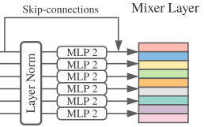

# MLP-Mixer: An all-MLP Architecture for Vision
(https://arxiv.org/pdf/2105.01601.pdf)

This code review comments by younghan, deokjoong

* 🎯 Overall framework

* 🎯 token mixing MLP : "mixing" spatial information

* 🎯 channel mixing MLP : "mixing" the per-location features

# 🔔 Another variation version paper
1. CycleMLP: A MLP-like Architecture for Dense Prediction (https://arxiv.org/pdf/2107.10224.pdf)  
2. Resmlp: Feedforward networks for image classification with data-efficient training (https://arxiv.org/abs/2105.03404)  
3. Beyond self-attention: External attention using two linear layers for visual tasks (https://arxiv.org/pdf/2105.02358.pdf)  
4. Vision permutator: A permutable mlp-like architecture for visual recognition (https://arxiv.org/pdf/2106.12368.pdf)  
5. Pay attention to mlps (https://arxiv.org/pdf/2105.08050.pdf)  
6. S^2-mlp: Spatial-shift mlp architecture for vision (https://arxiv.org/pdf/2106.07477.pdf)  

📢 original code by Rishikesh https://github.com/rishikksh20
